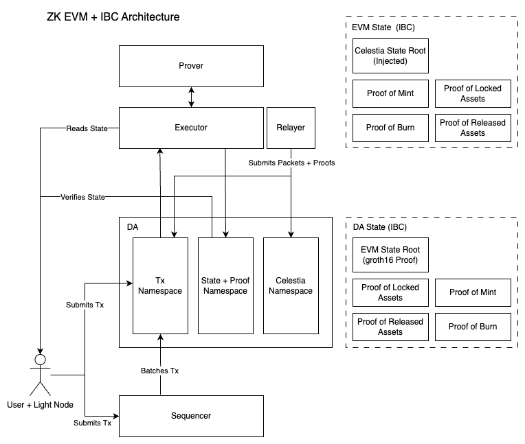

# IBC ZK-EVM Architecture Document

> [!NOTE]
> This is a work in progress designed to describe all the components needed for transferring tokens from Celestia to a ZK proven EVM

To provide some context on what we’re trying to achieve, we’re going to start with describing the user flow for transferring TIA to a ZK EVM (Based of the current flow)


1. A user submits a `MsgTransfer` to the Celestia chain. Celestia performs some validation checks on the message, then transfers the user’s funds to a module account, effectively locking the funds. The chain then creates a `Commitment` , a receipt of the successful execution of that message as well as an event emitted containing a `Packet` with information to send to the EVM rollup
2. A relayer listens for the event. It queries a Celestia consensus node for the `Commitment` in the state tree along with the merkle proof, proving the inclusion of that data. The relayer submits the packet along with the inclusion proofs to the rollups namespace.
3. The rollup full node validates the Celestia header as part of it’s STF, thus it does not require an `UpdateClient` message. It can be assumed that it always has the latest state root for verifying Celestia state. Reading the namespace it validates the `Commitment` and it’s inclusion in Celestia state. It then mints TIA (or the IBC denomination equivalent) and sends it to the recipient address. Similar to Celestia, it saves an `AcknowledgementCommitment` in state.
4. The relayer listens to the acknowledgement event, queries the state of the EVM Rollup alongside the 1) STF proof in groth16 form, 2) State inclusion proof of the `AcknowledgementCommitment` (as a Merkle Patricia Trie Proof). It submits a transaction with the first proof and often multiple second proofs batched together to Celestia.
5. Celestia validates the groth16 proof to update the EVM state root it has stored, it verifies the `Acknowledgement` in the EVM state using the inclusion proof. It then cancels the pending timeout thus confirming the transfer. Alternatively, after a timeout period, a timeout message can be sent to Celestia which will unlock the funds returning them to the user.

To transfer back follows a similar process except, instead of minting tokens, the EVM proves that they burned the tokens and Celestia proves back to the EVM that it released the tokens and gave it back to the user.

## Architecture

The architecture involves several different logical components:

- User + Light Node: Performs actions on either chain or rollup and uses the light client to verify every interaction
- Data Availability Layer (DA): Publishes a canonical serialised stream of transactions for rollup full nodes and light nodes alike to read and execute. Here we have a convention of separating the STF proofs and the rollup data into separate namespaces. The Celestia namespace can be one or more namespaces that Celestia validators read and execute over.
- Sequencer: batches transactions together from many users to lower the overall cost.
- Executor: reads transactions of a subscribed namespace and executes them to reach the next state. For this example we’re specifically talking about Reth.
- Prover: proves the computation to go from one state to the next. Publishes these proofs to the state namespace. An example of this for EVMs is RSP (Reth Succinct Prover) which is a circuit for proving the computation of a single block.
- Relayer: listens for events from both the EVM rollup full node and the Celestia consensus full node. It queries for commitments and proofs and submits them to the DA layer under the appropriate namespaces. We expect it to often run on the same machine as the sequencer.



## Proving System

Celestia will track the state roots of the ZK EVM through a ZK IBC Client. To update it, the relayer needs to submit a transaction with a groth16 proof and the public inputs (trusted reference height, new height, new state root etc.)

RSP has a circuit for proving the execution of a single block.

We need to write a circuit that proves the following computation:

- That a set of blobs was included in Celestia’s header hash (not just in the data root). This would be namespace inclusion proofs.
- The fork choice rule which decides which transactions and in which order should the state machine execute those blobs
- The execution of the filtered blobs given some prior state generates this new state

This circuit can then be repeated across multiple Celestia blocks to provide an aggregated proof from one height to another arbitrary height. Lastly, this needs to be wrapped in a groth16 circuit that can be verified by the ZK IBC Client.

```go
type PublicWitness struct {
	TrustedHeight int64 // Provided by the relayer/user
	TrustedCelestiaHeaderHash []byte // Provided by the ZK IBC Client
	TrustedRollupStateRoot []byte // Provided by the ZK IBC Client
	NewHeight int64 // Provided by the relayer/user
	NewRollupStateRoot []byte // Provided by the relayer/user
	NewCelestiaHeaderHash []byte // Provided by Celestia State Machine
	CodeCommitment []byte // Provided during initialization of the IBC Client
	GenesisStateRoot []byte // Provided during initialization of the IBC Client
}
```

## API

The prover needs to provide an API for the relayer to query aggregated proofs to submit to Celestia to update the IBC client state.

## Relayer Design

The relayer relies on an events system from both Celestia and the EVM rollup. These events should emit packets. The relayer then needs to query the rollup or Celestia state for the corresponding commitments alongside the proofs to the header. In either case, the relayer submits the transactions to Celestia either wrapped as a PFB for a certain namespace or as messages for Celestia’s reserved namespace (for the validators to execute themselves)
